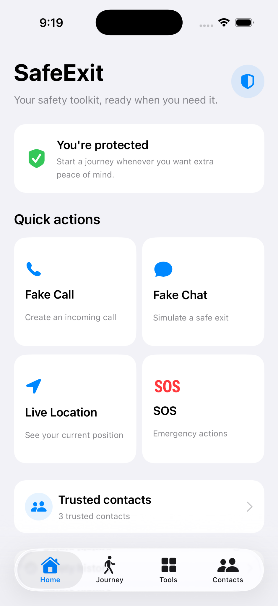
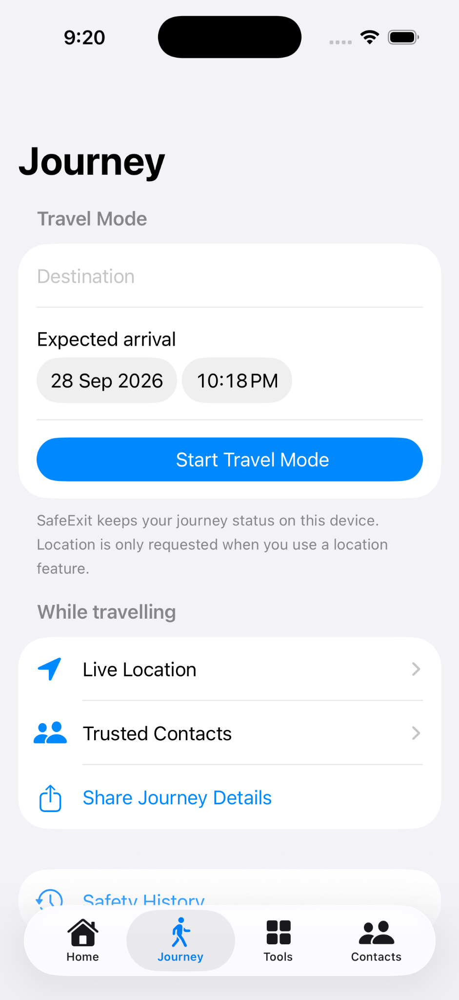
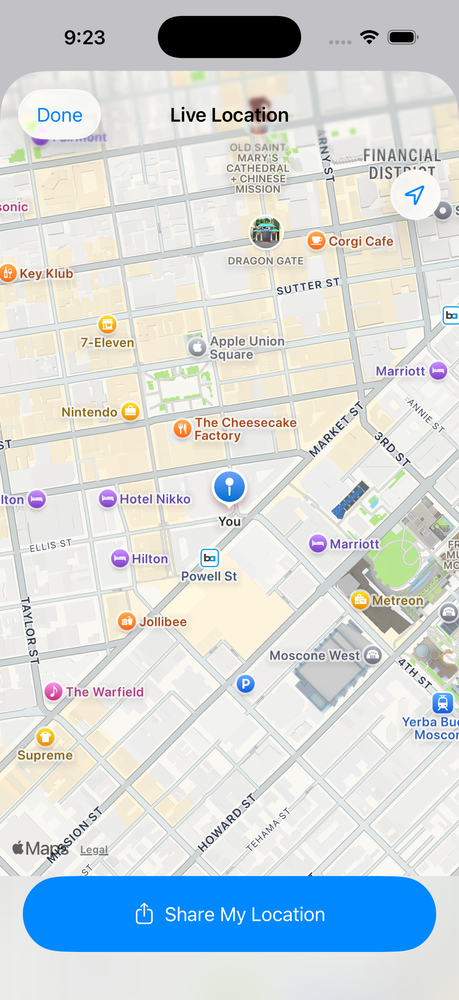
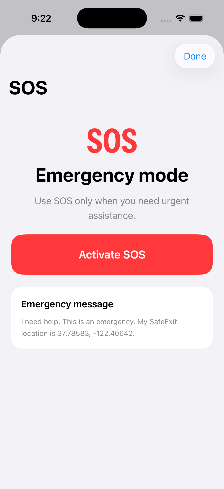
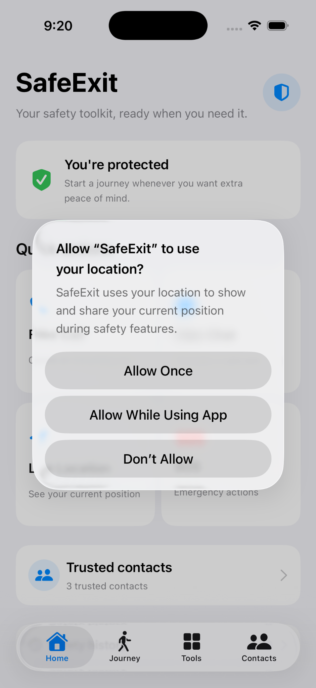

# 🛡️ SafeExit

### Your safety toolkit, ready when you need it.

SafeExit is an iOS safety application designed to provide quick, discreet, and accessible safety tools when users need them.

The app brings multiple safety features together in one simple interface, including **Fake Call, Fake Chat, Travel Mode, Live Location, SOS, and Trusted Contacts**.

---

## ✨ Features

### 📞 Fake Call

Fake Call allows users to schedule a realistic simulated incoming call.

It can be used as a discreet way to exit an uncomfortable situation.

**Features:**
- Custom caller name
- Adjustable call delay
- Simulated incoming call
- Local simulation
- Ringtone support
- Quick access from Home and Tools

### 💬 Fake Chat

Fake Chat provides a simulated conversation that can be used as a discreet exit tool.

**Features:**
- Simulated chat interface
- Custom conversation
- Realistic messaging experience
- Quick access from the Home screen

### 🚶 Travel Mode

Travel Mode allows users to enter their destination and expected arrival time before starting a journey.

During a journey, users can access:

- 📍 Live Location
- 👥 Trusted Contacts
- 📤 Share Journey Details
- 🕘 Safety History

### 📍 Live Location

Live Location displays the user's current position on an interactive map.

Users can also share their current location when needed.

### 🆘 SOS

SOS provides a dedicated emergency mode for urgent situations.

The SOS screen provides:

- Emergency activation
- Emergency message
- Location information
- Emergency actions

### 👥 Trusted Contacts

Trusted Contacts provides quick access to selected contacts during journeys or emergency situations.

---

# 📱 Screenshots

## 🏠 Home

The Home screen provides quick access to the main SafeExit safety features.

<p align="center">
  
</p>

---

## 🚶 Journey / Travel Mode

Users can enter a destination and expected arrival time before starting Travel Mode.

<p align="center">
  
</p>

---

## 🛠️ Safety Tools

The Tools screen provides centralized access to the application's safety tools.

It includes:

- Fake Call
- Fake Chat
- SOS
- Live Location

<p align="center">
  
</p>

---

## 📞 Fake Call

Users can configure a simulated incoming call by selecting the caller and the delay before the call.

<p align="center">
  
</p>

> **Note:** Fake Call is a local simulation and does not place a real phone call.

---

## 📍 Live Location

Live Location displays the user's current position on a map and provides an option to share the location.

<p align="center">
  
</p>

---

## 🆘 SOS

The SOS screen provides an emergency mode with an emergency activation button and emergency message.

<p align="center">
  
</p>

---

## 📍 Location Permission

SafeExit requests location permission when a location-based safety feature requires it.

<p align="center">
  
</p>

---

# 🔄 Application Workflow

```text
                         SafeExit
                            │
              ┌─────────────┴─────────────┐
              │                           │
            Home                       Journey
              │                           │
      ┌───────┼────────┐          ┌───────┼─────────┐
      │       │        │          │       │         │
   Fake    Fake      SOS       Location Contacts  Share
   Call    Chat                 │
                                │
                         Safety History
