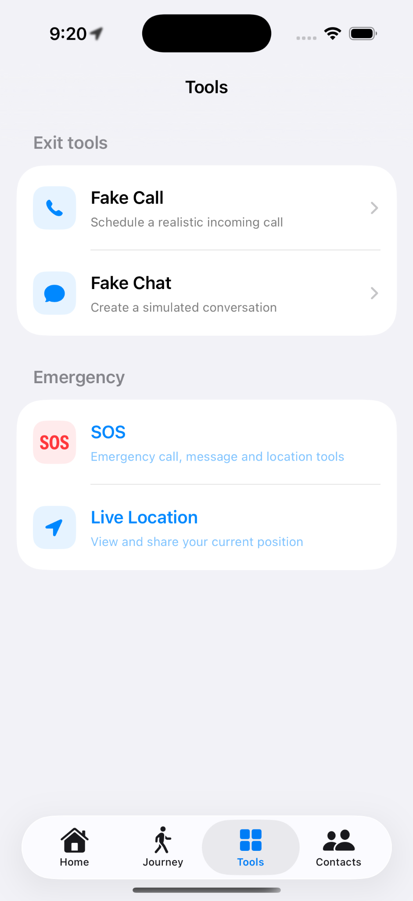

# 📱 Screenshots

## 🏠 Home

The Home screen provides quick access to SafeExit's main safety features, including Fake Call, Fake Chat, Live Location, SOS, and Trusted Contacts.

  

---

## 🚶 Journey / Travel Mode

Users can enter a destination and expected arrival time before starting Travel Mode.

  

---

## 🛠️ Safety Tools

The Tools screen provides centralized access to SafeExit's safety features.

- 📞 Fake Call
- 💬 Fake Chat
- 🆘 SOS
- 📍 Live Location

  

---

## 📞 Fake Call

Users can configure a simulated incoming call by selecting the caller and the delay before the call.

> **Note:** Fake Call is a local simulation and does not place a real phone call.

  

---

## 💬 Fake Chat

Fake Chat provides a simulated conversation designed to give users a discreet way to exit an uncomfortable situation.

  

---

## 📍 Live Location

Live Location displays the user's current position on a map and provides an option to share the location.

  

---

## 🆘 SOS

The SOS screen provides an emergency mode with an emergency activation button and emergency message.

  

---

## 📍 Location Permission

SafeExit requests location permission when a location-based safety feature requires it.

  

